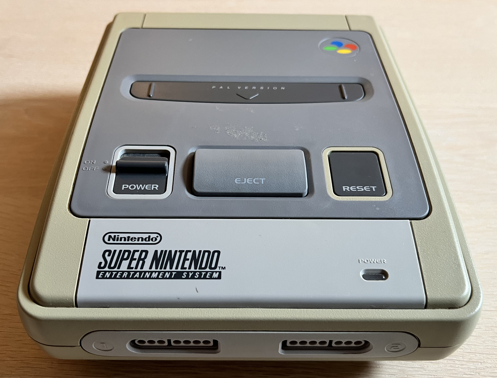
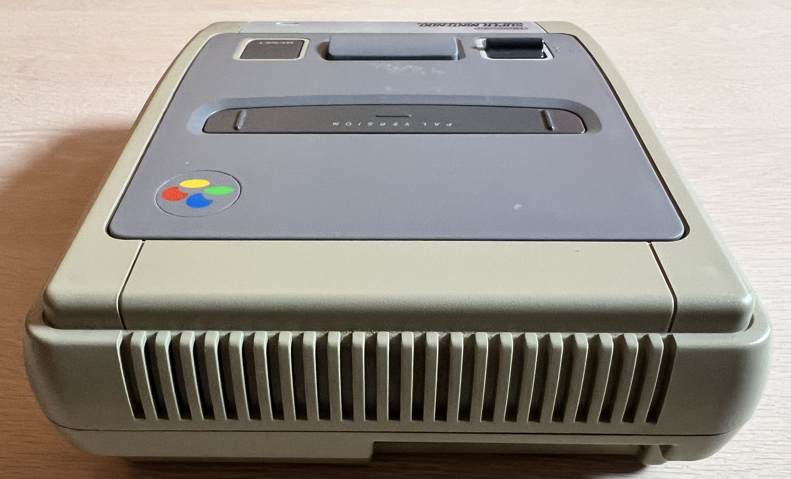
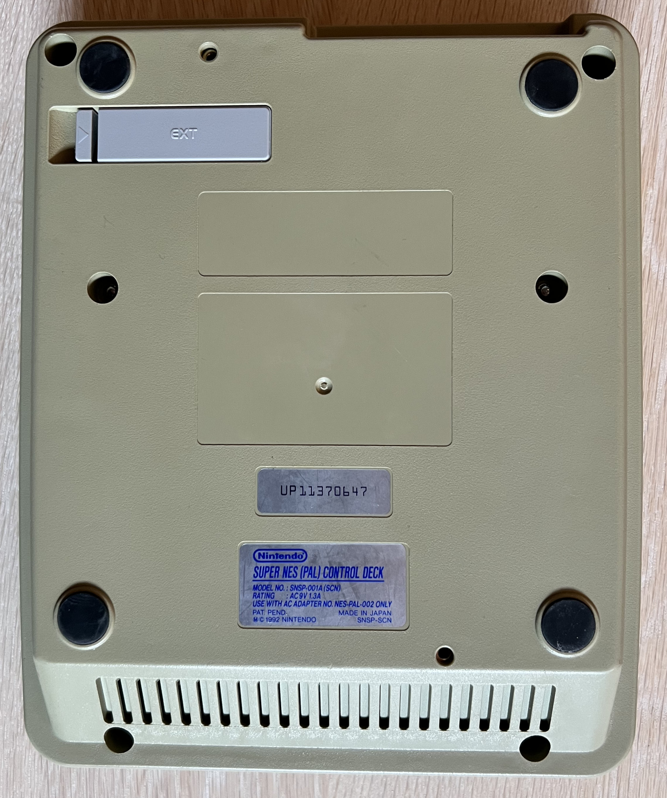

    

# Super Nintendo Entertainment System (SNES)

 

# Table of contents

<!-- TABLE OF CONTENTS -->

TOC - Click to enlarge

  <ul>
    <li>
      <a href="#starting-point">Starting point</a>
    </li>
    <li>
      <a href="#disassembly">Disassembly</a>
    </li>
  </ul>

<!-- MARK START -->

# Starting point

Oh... What is this? Some kind of ultra-rare Commodore peripheral? No, not at all! Say hello to the famous Super Nintendo Entertainment System (SNES)! This is the first time I have ever tried to refurbish a Nintendo device. And I have hardly ever used a SNES, so this will be a first.

The plan is to replace the capacitors, and give it a bit of "nip-and-tuck". If the device is not working I am probably going to be very challenged as I have zero spare parts for these devices. But, let´s see!

From the outside the SNES is quite dirty and severely yellowed. I can hear, vaguely, some kind of rattling sound inside as if something is loose inside. I do not know if the SNES works or not, but beside from dust and grease, it does looks to be in good mechanical condition.

Below are some pictures of the SNES before refurbishment.

    
    
    
    
    
    

# Disassembly

To start disassembling the SNES the six Gamebit screws[^1]. Note that you need a special tool for this operation: a Gamebit 4.5 mm screwdriver.

    

<!-- MARK STOP -->

**Footnotes**
[^1]: Gamebit pan head (5.3 mm), Sheet metal screw, Fully threaded, Thread diameter: 3.0 mm, Fastener length: 11.5 mm

