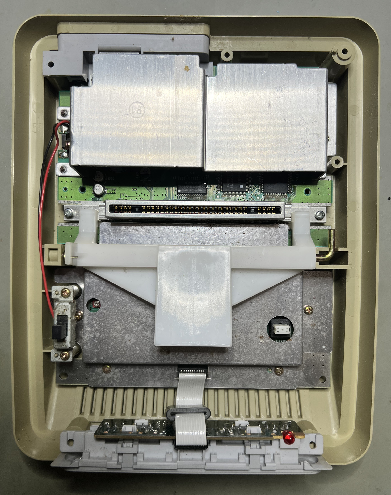
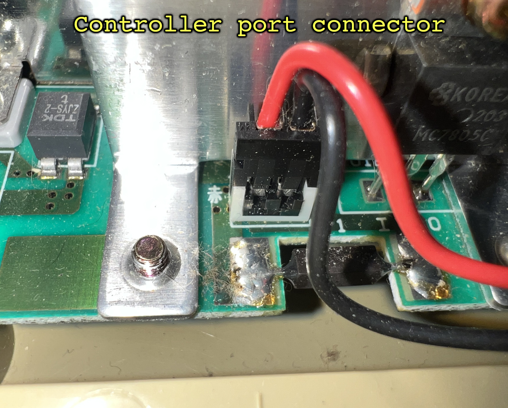
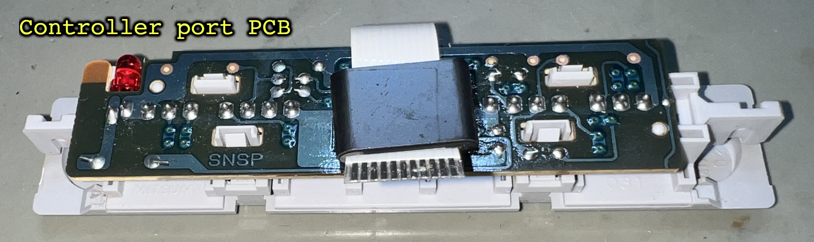
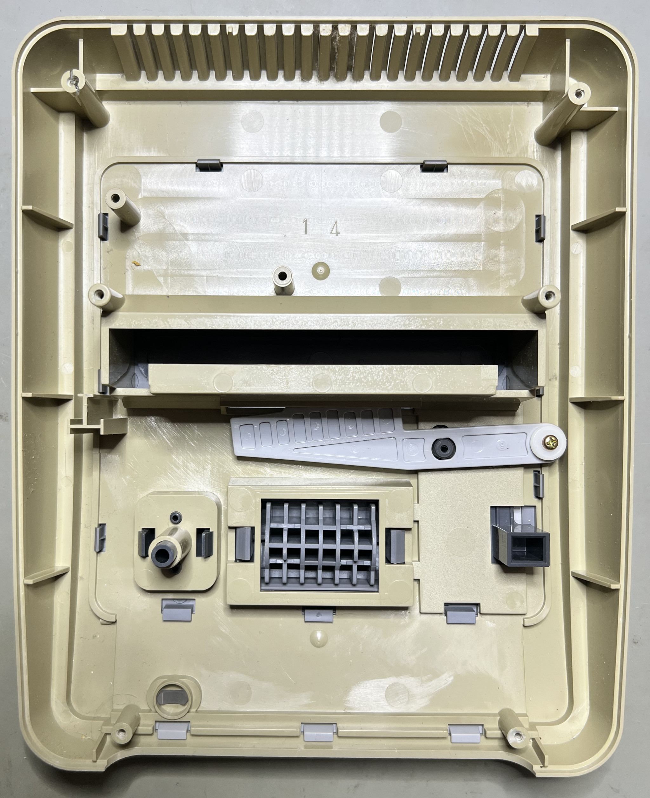
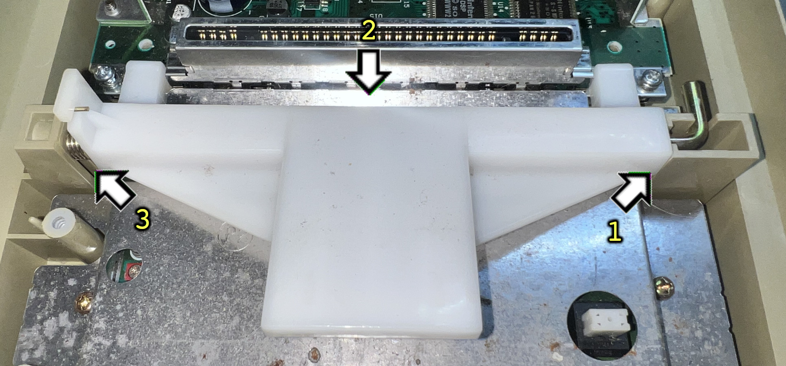
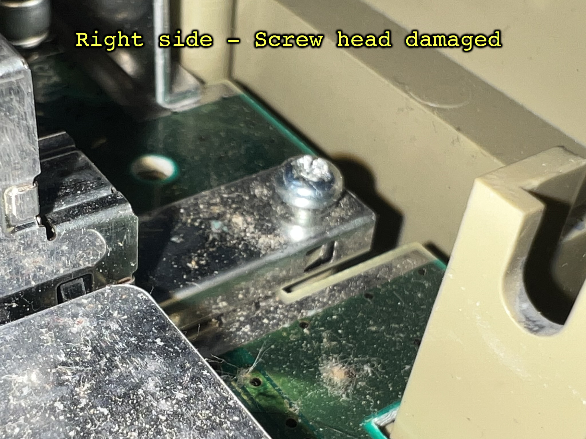
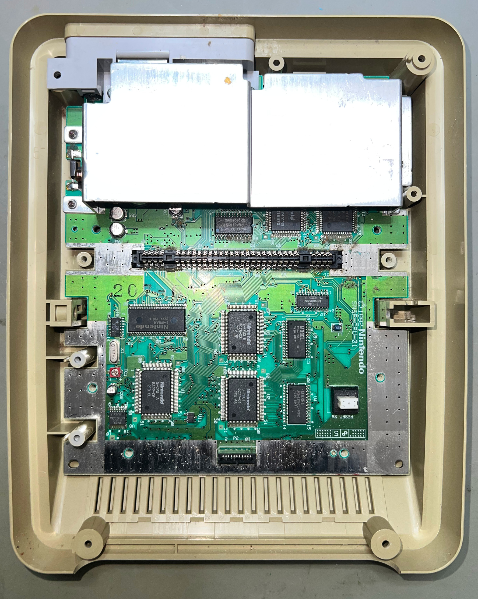

    

# Super Nintendo Entertainment System (SNES)

 

# Table of contents

<!-- TABLE OF CONTENTS -->

TOC - Click to enlarge

  <ul>
    <li>
      <a href="#starting-point">Starting point</a>
    </li>
    <li>
      <a href="#disassembly">Disassembly</a>
    </li>
    <li>
      <a href="#initial-testing">Initial testing</a>
    </li>
  </ul>

<!-- MARK START -->

# Starting point

Oh... What is this? Some kind of ultra-rare Commodore peripheral? No, not at all! Say hello to the famous Super Nintendo Entertainment System (SNES)! This is the first time I have ever tried to refurbish a Nintendo device. And I have hardly ever used a SNES, so this will be a first.

The plan is to replace the capacitors, and give it a bit of "nip-and-tuck". If the device is not working I am probably going to be very challenged as I have zero spare parts for these devices. But, let´s see!

From the outside the SNES is quite dirty and severely yellowed. I can hear, vaguely, some kind of rattling sound inside as if something is loose inside. I do not know if the SNES works or not, but beside from dust and grease, it does looks to be in good mechanical condition.

Below are some pictures of the SNES before refurbishment.

    
    
    
    
    
    

# Initial testing

Before the SNES is opened the device is connected to TV, powered and started. This is the result:

- With no cartridge installed: **POWER LED ON, BLACK SCREEN and NO AUDIO** // **POWER LED ON, NO VIDEO and NO AUDIO**
- With game cartridge installed: **POWER LED ON, BLACK SCREEN and NO AUDIO**

This is unfortunate. It can be an issue with oxidized cartridge port, blown fuse or poor voltages, broken traces (due to leaking capacitors) or a broken IC. Sometimes the device fail to produce a video output at all when powered on.

# Disassembly

To start disassembling the SNES the six Gamebit screws[^1]. Note that you need a special tool for this operation: a Gamebit 4.5 mm screwdriver.

    

With the Gamebit screws out of the way, the top cover is lifted. The interior is exposed, and I can see quite some dust and grease inside.

    

First, the ribbon cable for the control-port PCB is removed (1). Then the two screws holding the power switch are removed[^2] (2), and then finally the power switch cable is removed from the PCB (3). See pictures below.

    

    

The top cover appears to be in good mechanical condition.

    

Removing the cartridge eject mechanism is straighforward:

1) Lift the metal-rod on the right hand side from the plastic holder
2) Slide the large plastic part out from the holder on the left side
3) Remove the metal spring

    

    

With the cartridge eject mechanism out of the way, the next step is to remove the first RF-shield (P2) and the cartridge port connector. The RF-shield is held to the PCB with four screws[^3], and the cartridge connector is held by two screws[^4]. But now I notice something: The leftmost screw on the cartridge port connector is not fully fastened. Also, both the heads on these two Pozidriv screws are slightly damaged. Probably due to using a screwdriver of wrong size. This should not be much of a problem, but is something to investigate when troubleshooting.

    

    
    

When the RF-shield (P2) is removed a large part of the PCB is revealed. As can be seen from the picture below, this is a SNSP-CPU-01 mainboard. This is one of the early versions of the mainboard, and unfortunately known for failing (due to a bad `CPU-01`).

    

Before the mainboard PCB can be lifted from the bottom cover, the three remaining screws needs to be removed. One is located at the rear (right side)[^5] of the mainboard. The other two are[^6] partly hidden by the P1 RF shield. See pictures below.

<!-- MARK STOP -->

**Footnotes**
[^1]: Gamebit pan head (5.3 mm), Sheet metal screw, Fully threaded, Thread diameter: 3.0 mm, Fastener length: 11.5 mm
[^2]: Phillips pan head (5.4 mm), Sheet metal screw, Fully threaded, Thread diameter: 3.0 mm, Fastener length: 9.5 mm
[^3]: Phillips pan head (5.4 mm), Sheet metal screw, Fully threaded, Thread diameter: 3.0 mm, Fastener length: 9.5 mm
[^4]: Phillips pan head (5.3 mm), Sheet metal screw, Fully threaded, Thread diameter: 3.0 mm, Fastener length: 13.5 mm
[^5]: Phillips pan head (5.4 mm), Sheet metal screw, Fully threaded, Thread diameter: 3.0 mm, Fastener length: 9.5 mm
[^6]: Phillips pan head (5.3 mm), Sheet metal screw, Fully threaded, Thread diameter: 3.0 mm, Fastener length: 13.5 mm

