

    

# Super Nintendo Entertainment System (SNES)

 

# Table of contents

<!-- TABLE OF CONTENTS -->

TOC - Click to enlarge

  <ul>
    <li>
      <a href="#starting-point">Starting point</a>
    </li>
    <li>
      <a href="#disassembly">Disassembly</a>
    </li>
    <li>
      <a href="#initial-testing">Initial testing</a>
    </li>
    <li>
      <a href="#mainboard">Mainboard</a>
      <ul>
        <li>
          <a href="#visual-inspection">Visual inspection</a>
        </li>
        <li>
          <a href="#checking-the-voltages">Checking the voltages</a>
        </li>
        <li>
          <a href="#removing-corrosion">Removing corrosion</a>
        </li>
      </ul>
    </li>
  </ul>

# Starting point

Oh... What's this? Some kind of ultra-rare Commodore peripheral? No, not at all! Say hello to the famous Super Nintendo Entertainment System (SNES)! This is the first time I have ever tried to refurbish a Nintendo console. I have also hardly ever used a SNES, so this will be a first.

The plan is to replace the capacitors and give it a bit of a "nip and tuck." If the console is not working, I will probably be quite challenged, as I have no spare parts for these machines. But let's see!

From the outside, the SNES is quite dirty and severely yellowed. I can faintly hear some kind of rattling sound inside, as if something has come loose. I do not know whether the SNES works or not, but apart from the dust and grease, it appears to be in good mechanical condition.

Below are some pictures of the SNES before refurbishment.

    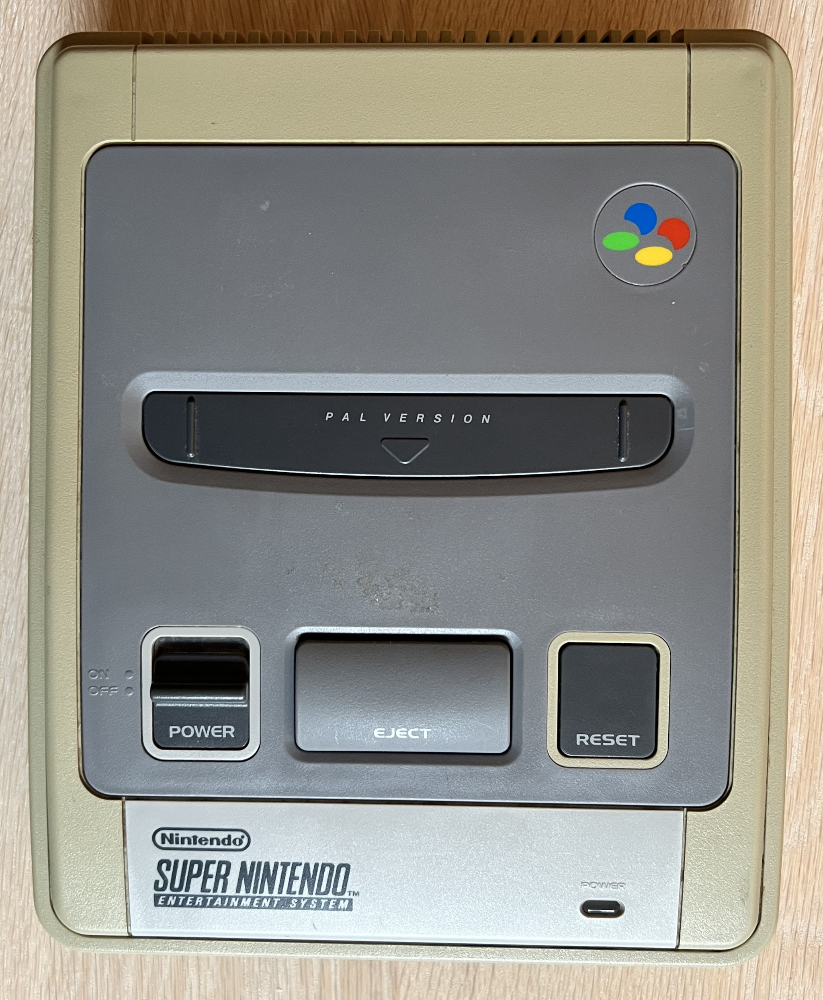
    
    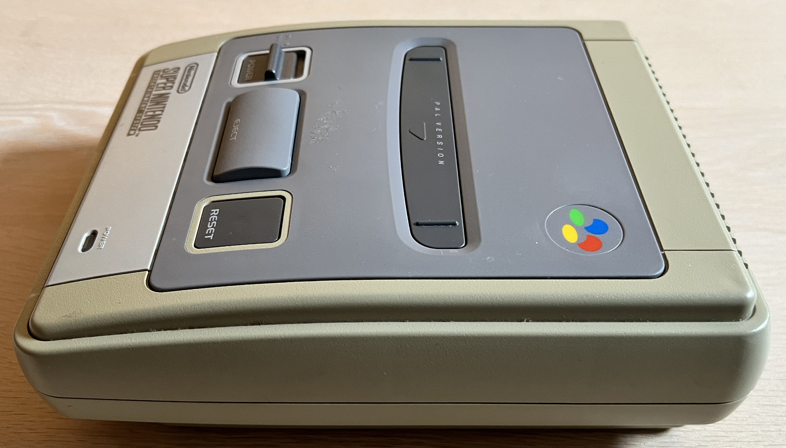
    
    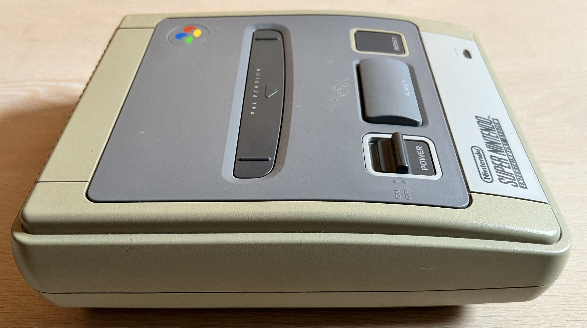
    

# Initial testing

Before opening the SNES, the console is connected to a TV, powered on, and tested. The results are as follows:

- Without a cartridge installed: **POWER LED ON, BLACK SCREEN, NO AUDIO** (occasionally: **POWER LED ON, NO VIDEO, NO AUDIO**)
- With a game cartridge installed: **POWER LED ON, BLACK SCREEN, NO AUDIO**

This is unfortunate. The fault could be caused by an oxidised cartridge connector, a blown fuse, incorrect supply voltages, broken PCB traces (due to leaking capacitors), or a faulty IC. Occasionally, the console fails to produce any video output at all when powered on.

# Disassembly

To start disassembling the SNES, remove the six Gamebit screws[^1]. Note that you will need a special tool for this operation: a 4.5 mm Gamebit screwdriver.

    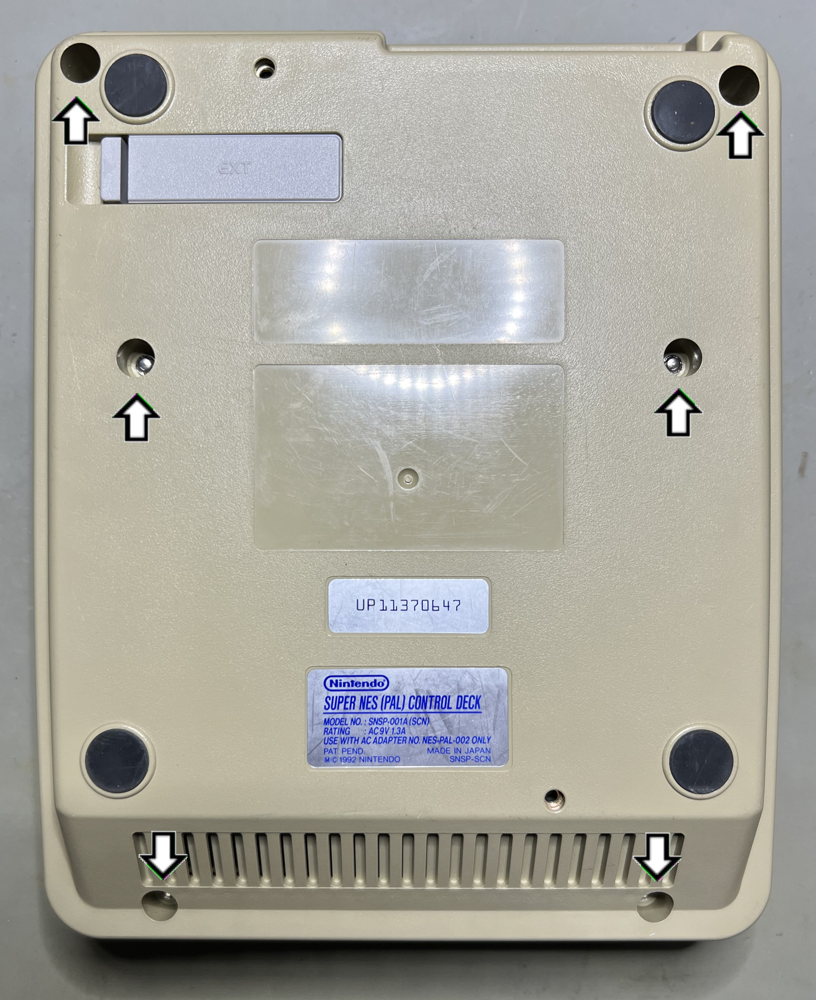

With the Gamebit screws out of the way, the top cover is lifted off, exposing the interior. As expected, I can see a fair amount of dust and grease inside.

    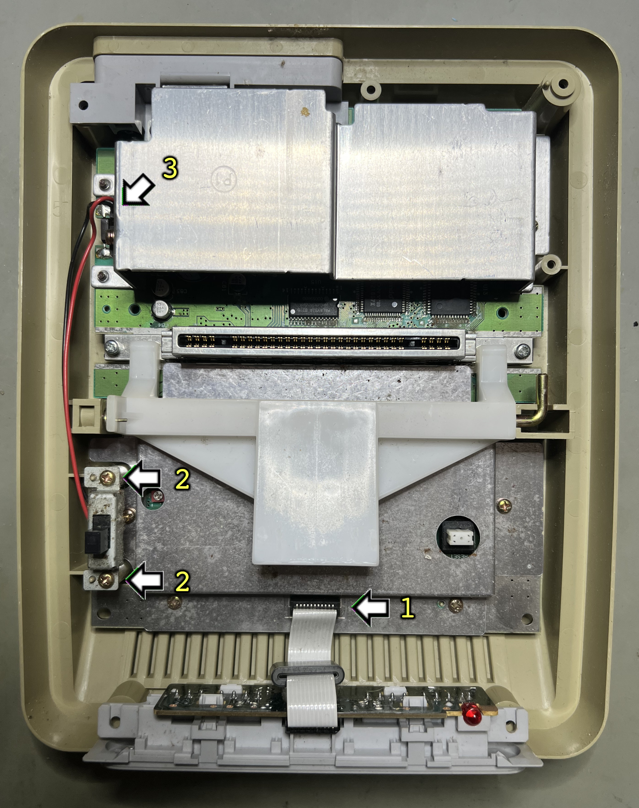

First, the ribbon cable for the controller port PCB is disconnected (1). Next, the two screws securing the power switch are removed[^2] (2). Finally, the power switch cable is disconnected from the mainboard (3). See the pictures below.

    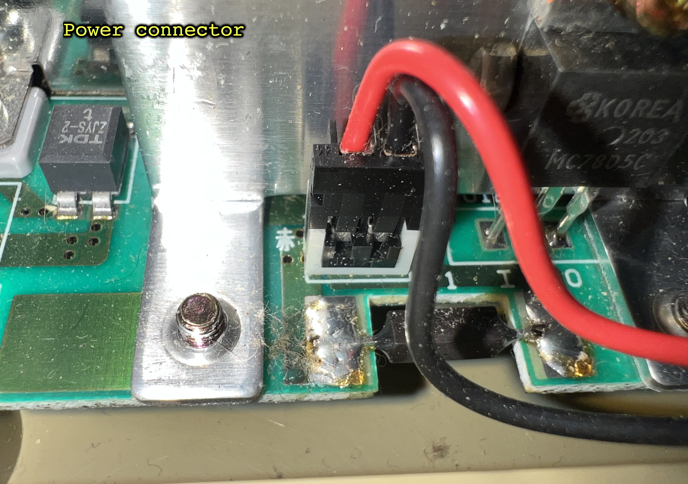

    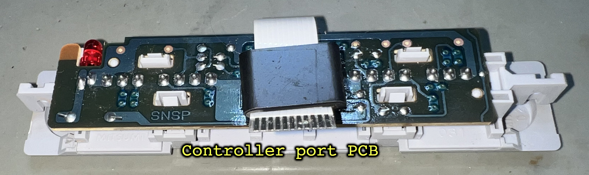

The top cover appears to be in good mechanical condition, with no obvious signs of cracks or other damage.

    

Removing the cartridge eject mechanism is straightforward:

1) Lift the metal rod on the right-hand side out of the plastic holder.
2) Slide the large plastic part out of the holder on the left-hand side.
3) Remove the metal spring.

    

    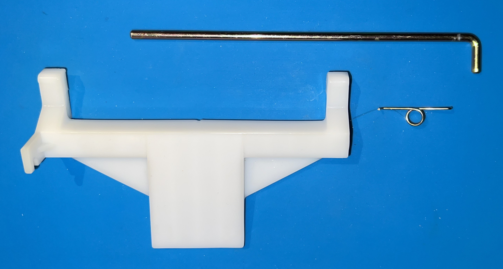

With the cartridge eject mechanism out of the way, the next step is to remove the first RF shield (P2) and the cartridge port connector. The RF shield is secured to the PCB with four screws[^3], while the cartridge port connector is secured with two screws[^4].

At this point, I notice something interesting: the leftmost screw securing the cartridge port connector is not fully tightened. In addition, the heads of both Pozidriv screws are slightly damaged, probably due to the use of an incorrectly sized screwdriver.

This should not be a major problem, but it is something worth investigating during the troubleshooting process.

    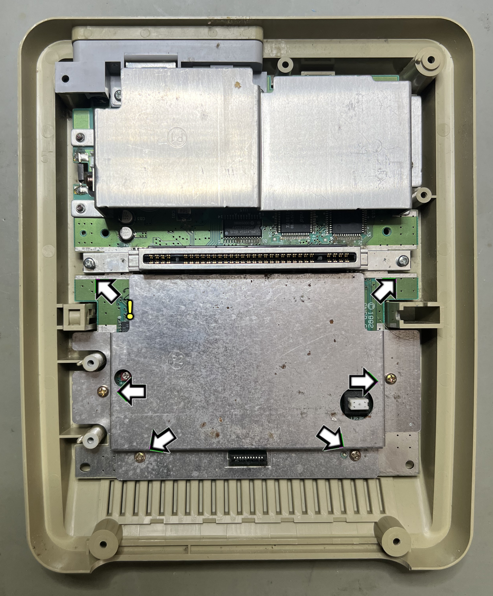

    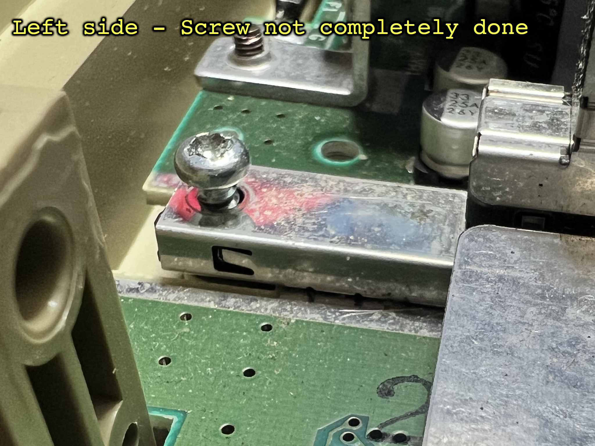
    

When the RF shield (P2) is removed, a large section of the PCB is revealed. As can be seen from the picture below, this is an SNSP-CPU-01 mainboard. This is one of the earlier revisions of the SNES mainboard and, unfortunately, is known for reliability issues due to the faulty `CPU-01` chipset.

    

Before the mainboard PCB can be lifted from the bottom cover, the three remaining screws need to be removed. One is located at the rear right-hand side of the mainboard[^5]. The other two are[^6] partially hidden beneath the P1 RF shield. See the pictures below.

    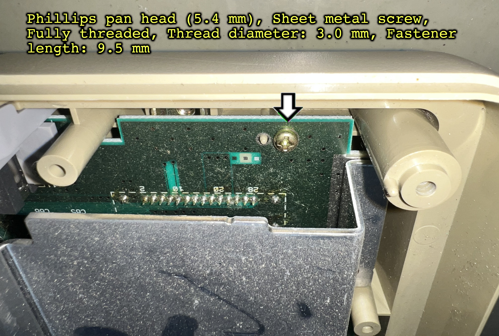

    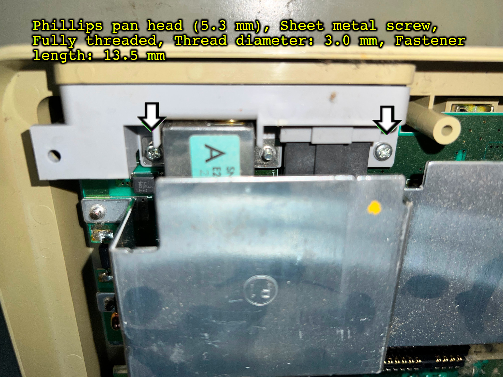

Now the mainboard PCB is lifted out of the bottom cover. The next step is to remove the screw[^7] securing the 7805 voltage regulator to the P1 RF shield, which also serves as its heatsink. **Note:** There are two washers on the screw: one flat washer and one spring lock washer. Also, for some reason, there is no thermal paste between the 7805 voltage regulator and the heatsink.

    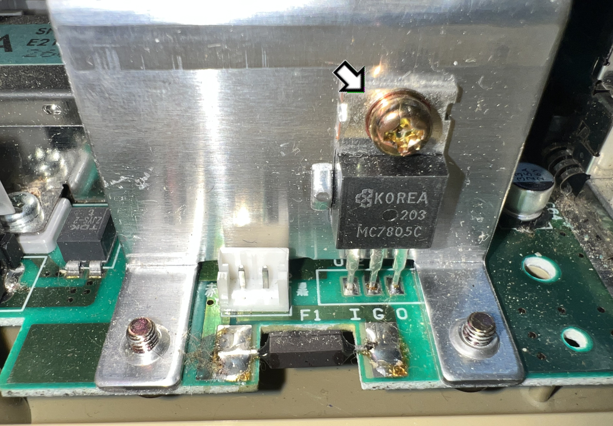

To remove the RF shield/heatsink marked "P1", remove the three machine screws[^8] from the underside of the mainboard. **Note:** Each screw is fitted with a toothed lock washer.

    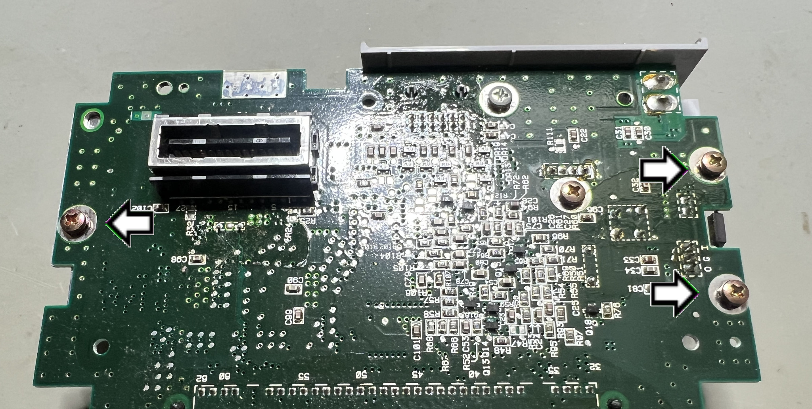

The SNES is now completely disassembled. The mainboard is ready for inspection, and the top and bottom covers are ready for cleaning.

**Note:** Before disassembly, I noticed a faint rattling sound coming from inside the console. However, during disassembly I did not find anything loose. It is possible that whatever caused the noise became dislodged during disassembly, but I am not entirely sure.

    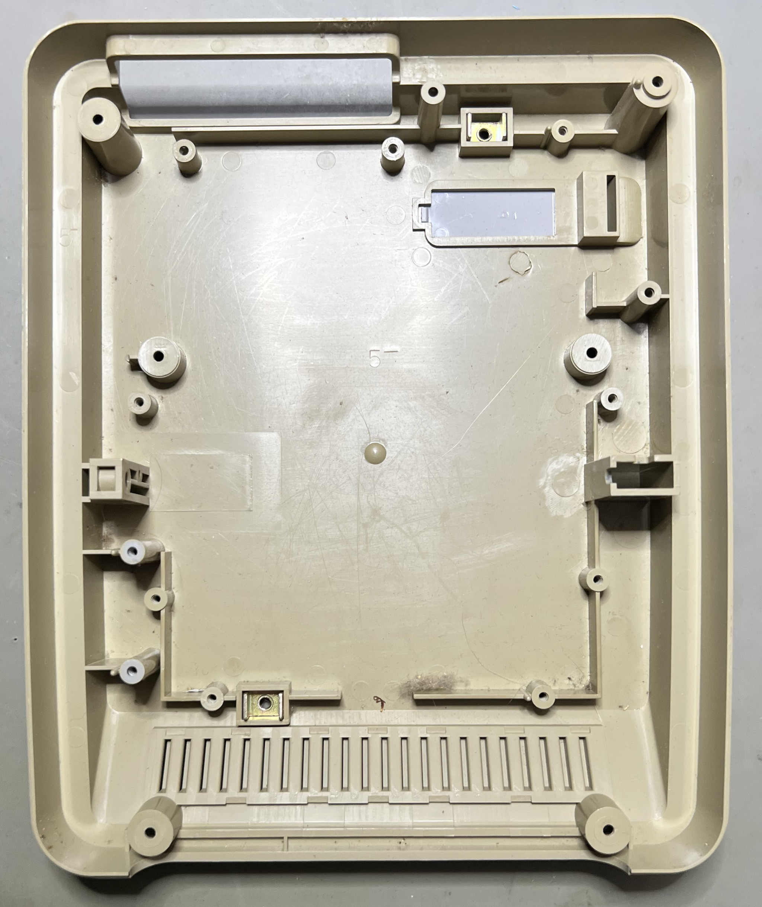

# Mainboard

The mainboard is an SNSP-CPU-01, one of the early revisions of the SNES mainboard.

## Visual inspection

There is a substantial amount of dust and grease on the mainboard. There is also quite a lot of flux residue on both sides of the PCB, but I believe this is fairly typical for early SNES consoles. While this is not a serious issue, there are a couple of areas that require attention:

- Capacitors C59, C60, and C61 have leaked.
- A PCB trace around pin 19 of the cartridge connector is corroded.

For transparency, I did not notice the corroded trace at first. It was pointed out by Mark from the YouTube channel The Retro Channel while we were discussing the fault on this SNES over Discord. Thanks, Mark!

    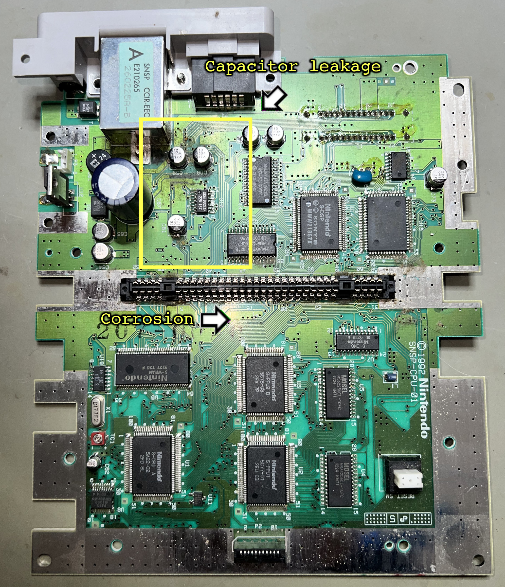

    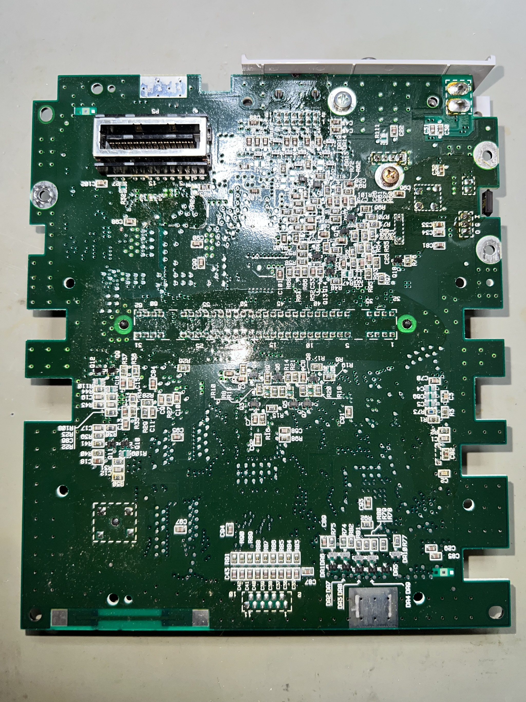

    
| Chip/Area | Manufactor | Version | Date code | Note |
|:----------:|:----------:|:----------:|:----------:|:----------:|
| CPU | Nintendo(Ricoh) | S-CPU A 5A22-02 | Unknown | |
| PPU#1 | Nintendo(Ricoh) | S-PPU1 5C77-01 | Unknown | |
| PPU#2 | Nintendo(Ricoh) | S-PPU2 B 5C78-03 | Unknown | |
| Work RAM | Nintendo | S-WRAM | W27 Y1992 | |
| Video RAM | MOSEL | MS62256CL-10FC | W24 Y1992 | x2 |
| Audio RAM | Hitachi | HM9453100FP | W16 Y1992 | x2 |
| S-DSP | Sony | Unknown | Unknown | Marked: WWW21867X |
| S-SMP | Sony | Unknown | Unknown | Marked: 20P5Y|

## Checking the voltages

  
| Measure point | Target voltage | Measured voltage Before refurbish| Measured voltage After refurbish | Note |
|:----------:|:----------:|:----------:|:----------:|:----------:|
| 7805 IN | 5 V DC | 7.481 V | TBD  V | PIN#1 7805(U12) |
| VCC | 5 V DC | 5.046 V | TBD  V | PIN#3 7805(U12) |
| VS | 9 V DC | TBD V | TBD V | Emitter Q18 |

## Removing corrosion

As identified during the visual inspection, there is some corrosion on the trace leading to pin 19 of the cartridge connector. If this trace is damaged, the SNES is likely to fail, as it carries data line D0, connecting the CPU, Work RAM, and PPU-1.

Below is a close-up of the affected area.

    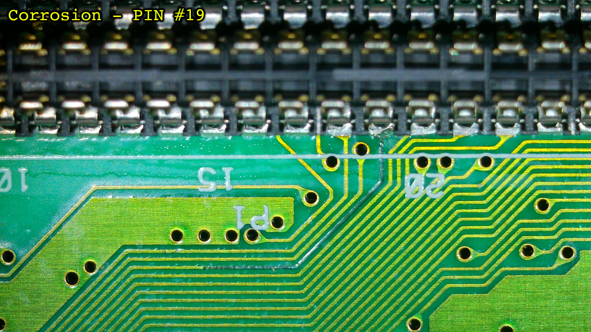

<!-- MARK START -->

<!-- MARK STOP -->

**Footnotes**
[^1]: Gamebit pan head (5.3 mm), Sheet metal screw, Fully threaded, Thread diameter: 3.0 mm, Fastener length: 11.5 mm
[^2]: Phillips pan head (5.4 mm), Sheet metal screw, Fully threaded, Thread diameter: 3.0 mm, Fastener length: 9.5 mm
[^3]: Phillips pan head (5.4 mm), Sheet metal screw, Fully threaded, Thread diameter: 3.0 mm, Fastener length: 9.5 mm
[^4]: Phillips pan head (5.3 mm), Sheet metal screw, Fully threaded, Thread diameter: 3.0 mm, Fastener length: 13.5 mm
[^5]: Phillips pan head (5.4 mm), Sheet metal screw, Fully threaded, Thread diameter: 3.0 mm, Fastener length: 9.5 mm
[^6]: Phillips pan head (5.3 mm), Sheet metal screw, Fully threaded, Thread diameter: 3.0 mm, Fastener length: 13.5 mm
[^7]: Phillips pan head (5.2 mm), Machine screw, Fully threaded, Thread diameter: 3.0 mm, Fastener length: 8.0 mm (plus flat washer and spring lock washer)
[^8]: Phillips pan head (6.2 mm), Machine screw, Fully threaded, Thread diameter: 3.0 mm, Fastener length: 7.0 mm (plus tooth washer)

